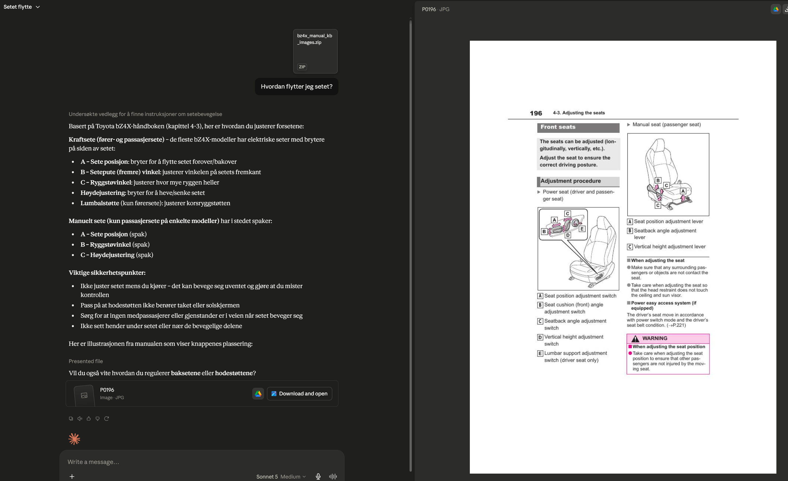

# Toyota bZ4X Touring LLM Manuals Repository

This repository contains comprehensive documentation for the Toyota bZ4X Touring vehicle in multiple formats optimized for different use cases, including LLM knowledge bases and human-readable markdown files.

## Repository Structure

### 📁 Markdown Files (`Markdown/`)
Plain-text markdown format documentation containing:
- **bz4x_touring_owners_manual.md** - Complete owner's manual in markdown format
- **bz4x_touring_navigation_manual.md** - Navigation system guide in markdown format

Markdown files are ideal for:
- Direct human reading in text editors
- Version control tracking (git-friendly)
- Integration with documentation systems
- Quick search and reference

### 📁 Knowledge Bases (`Knowledge base/`)

#### LLM Knowledge Base (without images): `bz4x_manual_kb.zip`
- Text-only knowledge base optimized for language model processing
- Reduced file size for efficient LLM ingestion
- Best for: Cost-effective RAG (Retrieval-Augmented Generation) systems, text-based AI applications
- Language model performance: Focused on text understanding without visual context

#### LLM Knowledge Base (with images): `bz4x_manual_kb_images.zip`
- Comprehensive knowledge base including embedded images and diagrams
- Enhanced visual documentation with product photos, schematics, and illustrations
- Best for: Multimodal AI systems, detailed troubleshooting with visual references, comprehensive understanding
- Language model performance: Supports vision-capable models for richer context

### Key Differences: Markdown vs. Knowledge Bases

| Aspect | Markdown Files | Knowledge Bases (KB) |
|--------|---|---|
| **Format** | Plain text with markdown syntax | Structured, indexed data format |
| **Use Case** | Human reading, documentation | LLM/AI system integration |
| **Searchability** | Linear search | Optimized retrieval & semantic search |
| **Visual Content** | Text references only | Images embedded (KB with images) |
| **File Size** | Lightweight | Compressed archives |
| **Integration** | Version control, web platforms | RAG systems, AI pipelines |

### 📁 Images (`images/`)
Supporting visual assets and illustrations:
- **Prompt1.png** - Example knowledge base structure and usage illustration

## Use Cases

- **Developers & Support Teams**: Use markdown files for quick reference and documentation
- **AI/LLM Applications**: Ingest knowledge bases into RAG systems for question-answering
- **Multimodal AI**: Leverage the image-enabled knowledge base for vision-capable language models
- **Knowledge Management**: Maintain both formats for flexibility across different systems

## Knowledge Base Formats

Both knowledge base archives are optimized for:
- Semantic search and retrieval
- Integration with vector databases
- LLM context window optimization
- Enterprise AI/ML pipelines

Choose the image-enabled version for applications requiring visual documentation and comprehensive context, or the text-only version for efficient text-based processing.